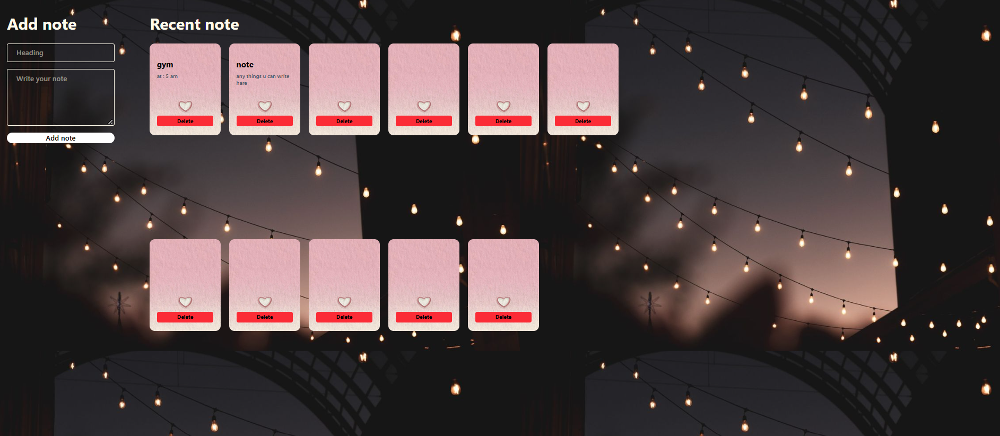

# 📝 Aesthetic React Notes App

A simple, responsive, and beautifully styled Notes Application built with React. It allows users to write, manage, and organize their daily notes seamlessly.

## 🖼️ App Preview
<p align="center">
  
    
</p>

## ✨ Features
- ➕ **Add Notes:** Quick creation of notes with title and detailed text.
- 🗑️ **Delete Notes:** Remove completed or unwanted notes instantly.
- 🎨 **Aesthetic UI:** Beautiful card design with dark/glow background theme.

## 🛠️ Tech Stack
- **Frontend:** React.js, JavaScript (ES6+)
- **Build Tool:** Vite
- **Styling:** CSS3

## 🚀 Getting Started

1. **Clone the repository:**
   ```bash
   git clone [https://github.com/PriyaSingh7877/note-project.git](https://github.com/PriyaSingh7877/note-project.git)
